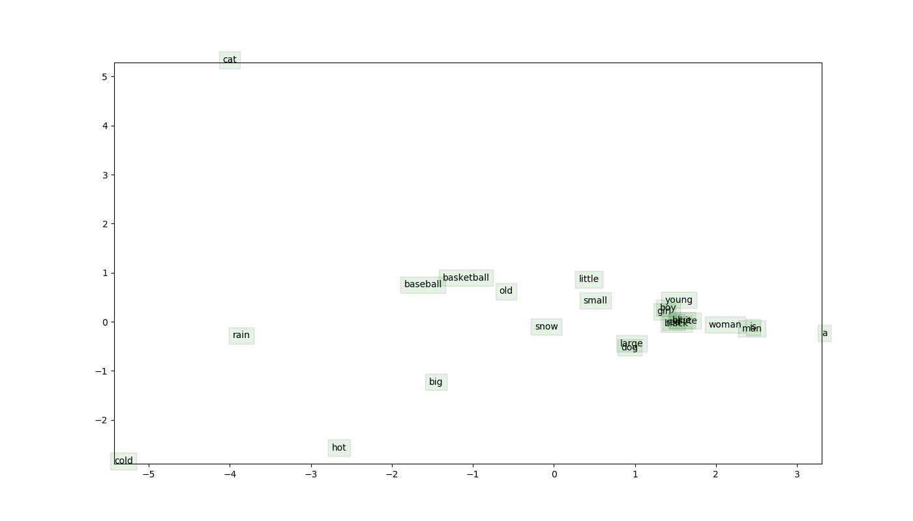
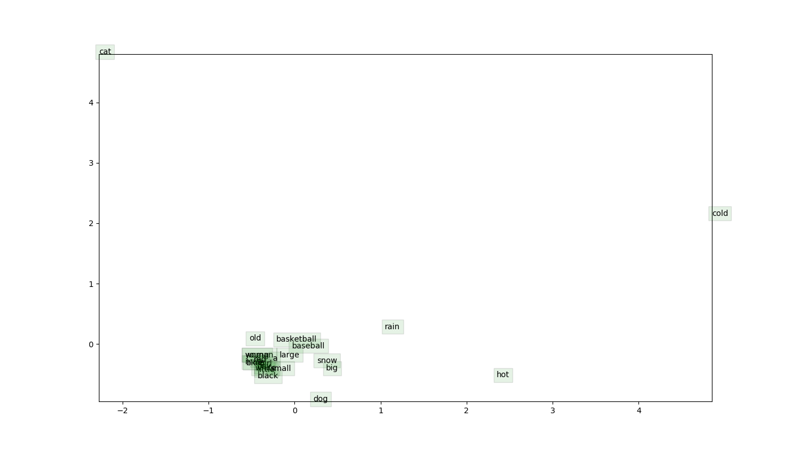

# Word2vec word representation visualization

Negative sampling softmax is proposed to decrease the computation cost of softmax denominator term by sampling several words that are not in the context of center word, instead of taking all words in the vocabulary into consideration.
However, when it comes to the quality of the representation, naive sampling give superior result as seen in the following figures.
That is because, only sampled negative word embeddings are affected during training for the negative sampling softmax and the distance between un-related words that are not sampled are not affected, thus not scattered.
## Naive softmax

## Negative sampling softmax

